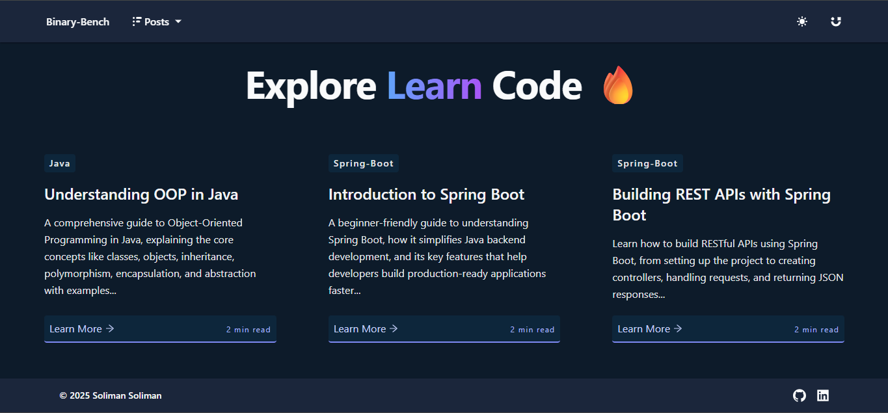

# Binary-Bench

This is a personal blog project crafted to showcase clean design and preformance using Next.js and Tailwindcss. It features SEO optimaization, and responsive design with dark mode support. The projcet demonstrates modern fornt-end development practices, with a focus on developer experience, scalability, and maintainable code.

<h2>
  
  [Binary Bench](https://binary-bench.vercel.app/)
  
</h2>

  
  
  

## Technologies Used
<ul>
  <li> Nextjs </li>
  <li> react-icons </li>
  <li> Tailwindcss </li>
</ul>

## Features

🌙 Dark Mode

📱 Fully Responsive

📃 Markdown Support

📖 Multi-Clock layout

